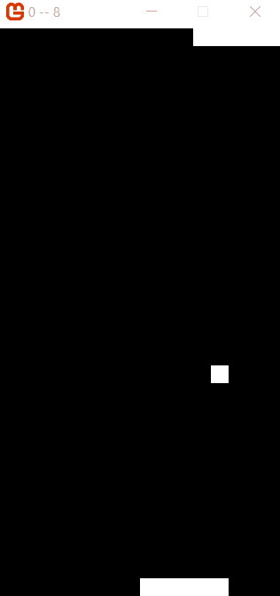

# Griddle


### The game engine for cave men.

## What is Griddle?

Griddle is the most basic game engine any human being could ever write.  It breaks the concept of a game engine down to its absolute roots.  Writing games in Griddle is extremely easy (also, very tedious).  Everything in Griddle is simple because you can't really do much with it.  

The concept was inspired by development on Commodore 64, back when you had to place each and every pixel of a sprite on screen manually.  Those were the good old days.

## Documentation

### Making a game

To make a griddle game, you'll need to create a new MonoGame project.  This is because Griddle was written in Monogame, although i'd be open to porting it to other game frameworks someday.  

The actual game should be a class you create that extends "GriddleGame".  You'll have to implement 2 methods:

* **GameInitialize**: Runs the first time the game loads.  Define sprites, load data, etc here
* **GameUPdate**: Runs once per game update.  Put game logic here.

To run the game, simply go to your monogame Program.cs class and run the game like so:

```
    using var game = new GriddleDesktopGame(
        new HelloWorldGame(size: new Vector2(16,16))
    ); 

    game.Run();
```

(where HelloWorldGame is the name of your game class).

The 'size' property is the size of your grid.  In this example, there are 16 x 16 pixels to work with.  

## Concepts

### The grid

Griddle uses a virtual 'grid' to simulate the low resolution aspect of classic game development.  Each grid square is called a 'pixel'.  Pixels can be grouped together in 'sprites'.  

As an analogy, think of the grid as your screen.  Just a grid of pixels.  But don't confuse Griddle pixels with actual pixels on your screen.  Griddle doesn't care about the actual resolution of your game, and neither should you. 

### Actors

An actor is just a class that wraps a sprite.  This allows you to add encapsulated game logic.  For an exmaple check out my awesome "Pong" game.  

## Examples

I included a few examples in the repo to show you the true *power* of Griddle:





